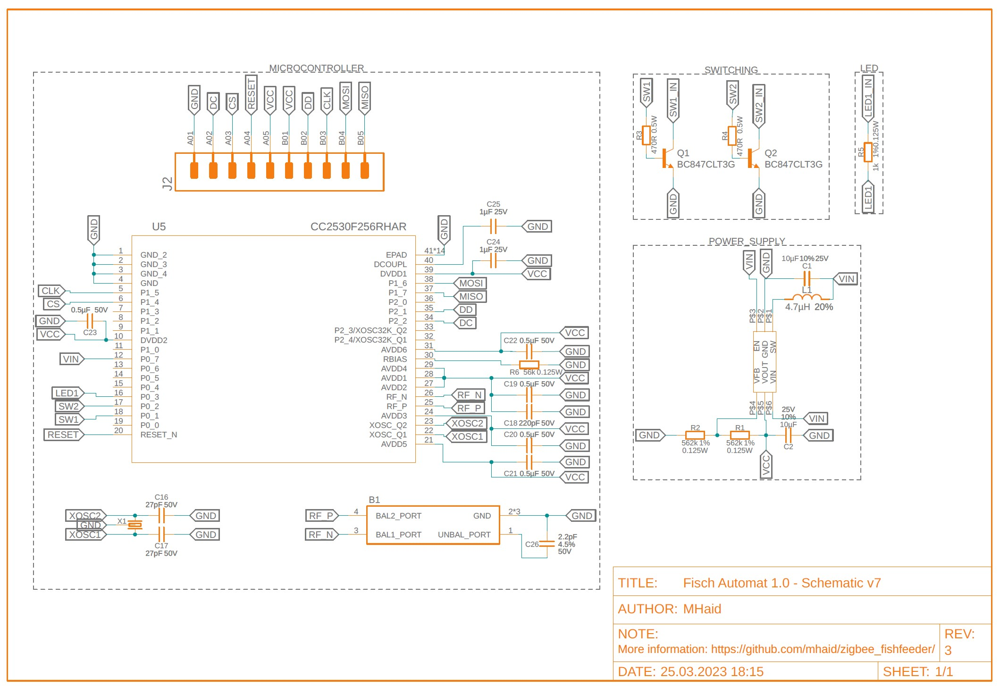
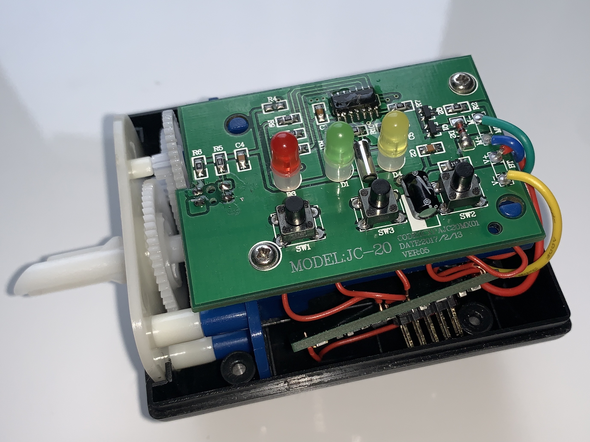
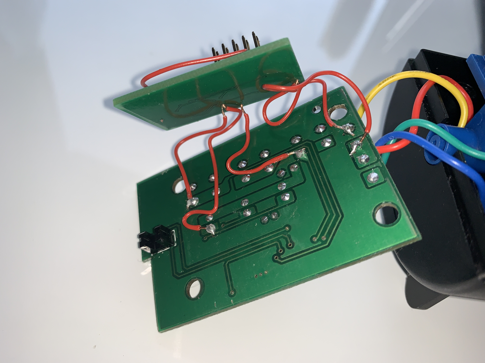
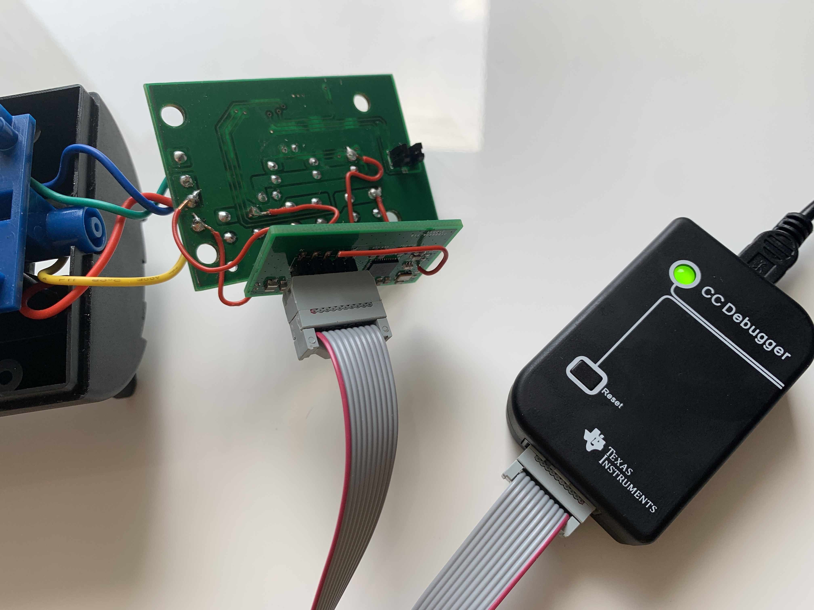
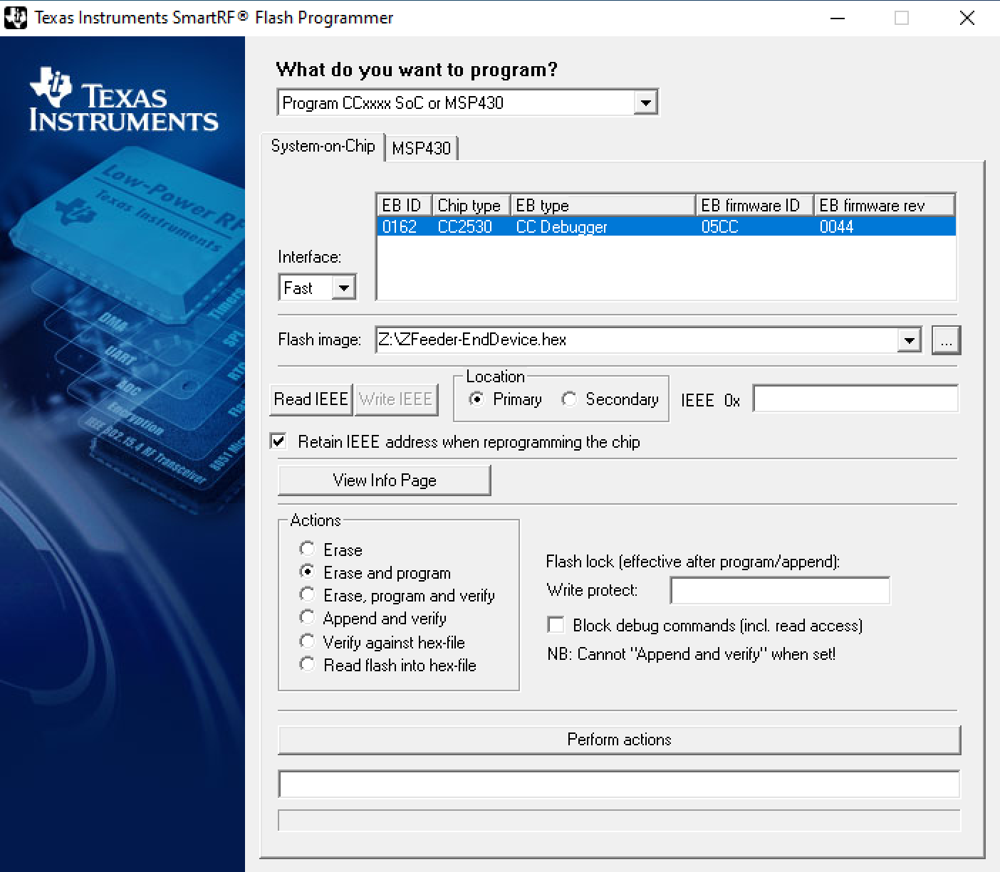
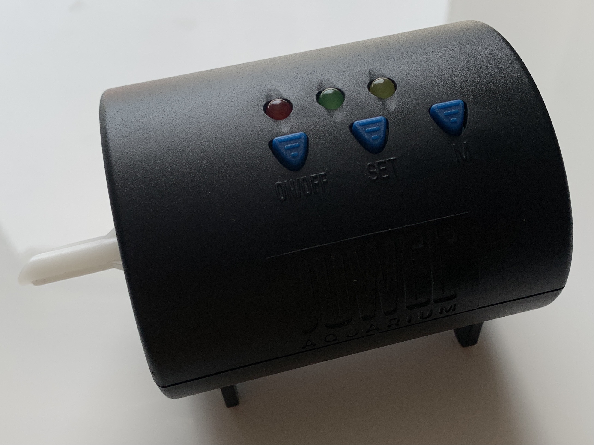

# ZigBee automatic feeder for fish
ZigBee automatic feeder for fish based on the TI CC2530.

## Intruduction
### Purpose
The purpose of the fish feeding project is:
1. to monitor the battery so that a low battery is noticed immediately;
2. to control the feeding time and quantity through the smarthome system.

### Feeder requirements
In this project I modified my automatic feeder (JUWEL Product nr. 89000).
Other feeders can be modified instead, if they:
1. have sufficent room for a custom PCB (4cm x 2.5cm);
2. use on or two AA batteries as power supply;
3. have accessible contacts for: trigger on/off, trigger feeding process and on/off status voltage.

### What you will need
For the building process you will need:
1. A custom PCB (bought or selfmade)
2. The components listed in the BOM
3. Solder paste, hot air gun (for SMD) + solder wire, solder station (for TH-wires),
4. An automatic feeder which meets the requirements listed in _Feeder requirements_
5. A smarthome system with ZigBee support (and preferably the possibility to integrate own devices)

## Building process
### Investigate your feeder
First have a look at the available space for an extra PCB in your feeder.
Once you got measurements on how big the PCB can be, search for the following contacts:
1. ON/OFF button (high side)
2. Manual feeder trigger button (high side)
3. ON/OFF status
You will have to solder a cable onto those, so be sure it is doable before ordering a PCB.
If it is not, you will propably have to replace the default PCB.

**Important note:** If your Feeder uses batteries with a combined voltage of more than 3.6 V you will have to use a voltage divider before Pin 0.7 of the CC2530 as it could otherwise destroy your chip. Please also note that the power supply used here is not be the best choice for input voltages > 3.3V. It is designed to step up and not to step down the battery voltage.

### Do I have to design my own PCB?
You can of course replace the default feeder circutry with your own. For my project I decided not to to that, as the default circuit already implements the motor control nicely. Also in the case of the JUWEL feeder there is enough space available.
If you decide to replace the default circutry, it would be awesome if we could publish the gerber files in this project for others to use. 

### Order the PCB and components
After validating, that the provided PCB is a good fit, or after designing your own PCB, it is time to order them.
There are many options where to order:
Local suppliers are usually good choice, but they aren't the cheapest when ordering low quantitys.
For the EU _multi-circuit-boards.eu_ or _eurocircuits.com._
If you like it cheap: _jlcpcb.com_ or _pcbway.com_
For ordering the components, find a local distributor or order at DigiKey, Mouser, etc.
The BOM of all required components can be found in the repository.
As the official CC-Debugger is quite expensive, you can also order thrid party debuggers from amazon or ebay. I got an official and an unofficial CC-Debugger, both work without any problem.

### Soldering and flashing
Once you recieved the PCBs and components, solder them on the PCB. Also connect cables to the five through-hole contact on the PCB and solder them onto the correct contact of the feeder.

Now connect the CC-Debugger with the 6-Pin-Connector, press the button on the debugger and check if the green led lights up. If it stays red, check the polarity of the connector and try again. If it still does not work, check your solder joints.

Once successfully connected, downlaod the .hex file from this project, open the [TI Flash Programmer](https://www.ti.com/tool/FLASH-PROGRAMMER) (not TI Flash Programmer 2 !) and select the .hex file.
After flashing, you are ready to go.

I already implemented the device into Homey, but an implementation into other open ZigBee-Coordinators is possible. You could also use this ZigBee-Device as "Basic ZigBee Device", but it is possible that not all the features work correctly.

Have fun with your new smart feeder!

Cheers,
Morris

